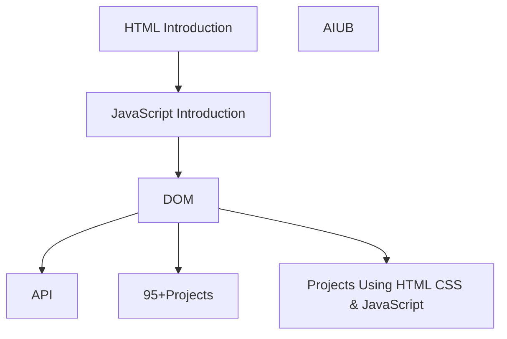

# HTML.CSS.JAVASCRIPT — Architecture

## 1. Stack
- HTML, CSS, vanilla JavaScript (no framework observed).
- No package.json / go.mod / pyproject.toml / Cargo.toml at REPO_ROOT — no dependency manager or build tool found.
- `.vscode/package.json` exists but is VS Code editor tooling config, not a project manifest.
- Static files only: `.html`, `.css`, `.js` opened directly in a browser (per README.md "How to Use").

## 2. Directory map
| path | what lives there |
|---|---|
| `HTML Introduction/` | `index.html` — HTML fundamentals, document structure |
| `JavaScript Introduction/` | `Day 0/` … `Day 5/` — JS basics `.js` files, one folder per day |
| `DOM/` | 14 numbered lesson folders (`01_...` – `14_...`) + `OOPS.md` — DOM/JS deep-dive lessons |
| `API/` | `Get Request.html` — fetch/API examples |
| `95+Projects/` | Standalone project folders, e.g. `Github Profile Search/`, `Project_1(...)/` |
| `Projects Using HTML CSS & JavaScript/` | Larger combined projects, e.g. `Youtube VIdeo Play/` |
| `AIUB/` | `Lab Task 0/`, `TASK 1/` — university lab assignments |
| `.vscode/` | `launch.json`, `package.json`, `settings.json` — editor config, not app code |
| `README.md`, `test.js`, `.gitignore` | root-level files |

## 3. Diagram

## 4. Component index
- [[HTML Introduction]]
- [[JavaScript Introduction]]
- [[DOM]]
- [[API]]
- [[95+Projects]]
- [[Projects Using HTML CSS & JavaScript]]
- [[AIUB]]

## 5. Entry points
- No dev server or build command found (no manifest at REPO_ROOT).
- Dev/prod are the same: open a lesson/project's HTML file directly in a browser, e.g.:
  - `HTML Introduction/index.html`
  - `AIUB/Lab Task 0/index.html`
  - `95+Projects/Github Profile Search/index.html`
  - `API /Get Request.html`
- README.md line 94: "Open any project's `index.html` in your browser."

## 6. Conventions
- `DOM/` lessons are prefixed with a two-digit order number, e.g. `01_All DOM selector`, `02_Create New Element` (observed folder names).
- `JavaScript Introduction/` is split into `Day 0` … `Day 5` folders (observed).
- Project folders under `95+Projects/` bundle their own `index.html` + `style.css`/`styple.css` + `script.js` (observed in `Github Profile Search/` and `Project_1(...)/`).
- `Project_1(Price Range Slider with Min-Max Input using HTML CSS and JavaScript)/` uses a misspelled `styple.css` filename (observed as-is, not corrected here).
- `API ` and `DOM ` directory names carry a trailing space on disk (observed via directory listing).

## 7. Where things go
- New HTML/CSS/JS basics lesson → add file under `HTML Introduction/` or `JavaScript Introduction/Day <N>/`.
- New DOM lesson → new folder in `DOM/` following the `NN_Topic Name` numbering.
- New standalone mini-project → new folder under `95+Projects/` with its own `index.html`/`style.css`/`script.js`.
- New combined/larger project → new folder under `Projects Using HTML CSS & JavaScript/`.
- New university lab task → new folder under `AIUB/`.
